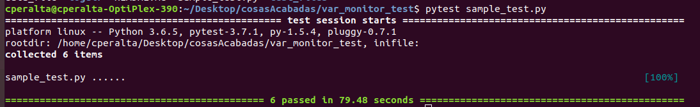

# var_monitor_test

## Getting Started

Script to test changes on var_monitor.py. It shows if the changes made on var_monito.py have modified its behaviour.  

### Folders 

There are 2 folders on this project : 

* **/logdir :**  Stores usage files generated on test execution with the current version of var_monitor.py. 
            **logdir/usage_test :** Stores the correct data of an execution of the test programm with 
* **/test_files :** Stores the files used to run both memory and IO r/w tests. 

## How to use it 

To run the test you need to have installed pytest. 

```
> pytest sample_test.py
```
Once test is finished if everything is correct it'll show something similar to the image below. 


